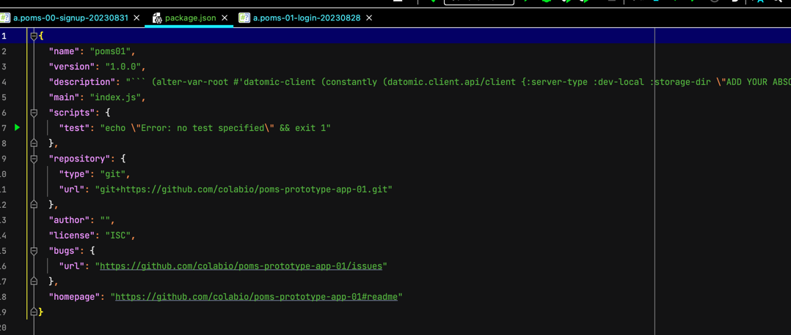
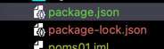

# React-Reagent setup and config

Let's add npm/package.json file into project.

```
$ npm init
```

Set up your package.json and then package.json file going to be created


Add react-reagent dependencies

```
"dependencies": {
    "create-react-class": "^15.7.0",
    "process": "^0.11.10",
    "react": "^18.2.0",
    "react-dom": "^18.2.0",
    "slate": "^0.94.1",
    "slate-react": "^0.97.0"
  }
```

```
$ npm install
```

after npm install command runs you will see

package-lock.json file is created.

Let' add reagent dependency indo deps.end file.

```
reagent/reagent {:mvn/version "1.2.0"}
```

import required packages

```
#?(:cljs (:require-macros [app.poms-00-signup-20230831 :refer [with-reagent]]))
            #?(:cljs ["react" :as react])
            #?(:cljs ["slate" :refer [createEditor]])
            #?(:cljs ["slate-react" :refer [Slate Editable withReact]])
            #?(:cljs [reagent.core :as r])
            #?(:cljs [reagent.dom :as rdom])
            #?(:cljs ["react-dom/client" :as ReactDom])
            #?(:cljs ["react-data-table-component$default" :as DataTable])
```

add boilerplate code blocks in your namespace
```
#?(:cljs (defn create-root
"See https://reactjs.org/docs/react-dom-client.html#createroot"
([node] (create-root node (str (gensym))))
([node id-prefix]
(ReactDom/createRoot node #js {:identifierPrefix id-prefix}))))
#?(:cljs (defn render [root & args]
(.render root (r/as-element (into [:f>] args)))))
(defmacro with-reagent [& args]
`(dom/div
(let [root# (create-root dom/node)]
(render root# ~@args)
(e/on-unmount #(.unmount root#)))))
```


# POMS Demo project CONFIG
```
(alter-var-root #'datomic-client (constantly (datomic.client.api/client {:server-type :dev-local
:storage-dir "ADD YOUR ABSOLUTE DATABASE PATH HERE" 
;CONTENT/REPO DATABASE PATH: poms-db/ci/poms-db 
:system "ci"})))
```

# POMS Demo project

```
$ clj -A:dev -X user/main

Starting Electric compiler and server...
shadow-cljs - server version: 2.20.1 running at http://localhost:9630
shadow-cljs - nREPL server started on port 9001
[:app] Configuring build.
[:app] Compiling ...
[:app] Build completed. (224 files, 0 compiled, 0 warnings, 1.93s)

👉 App server available at http://0.0.0.0:8080
```